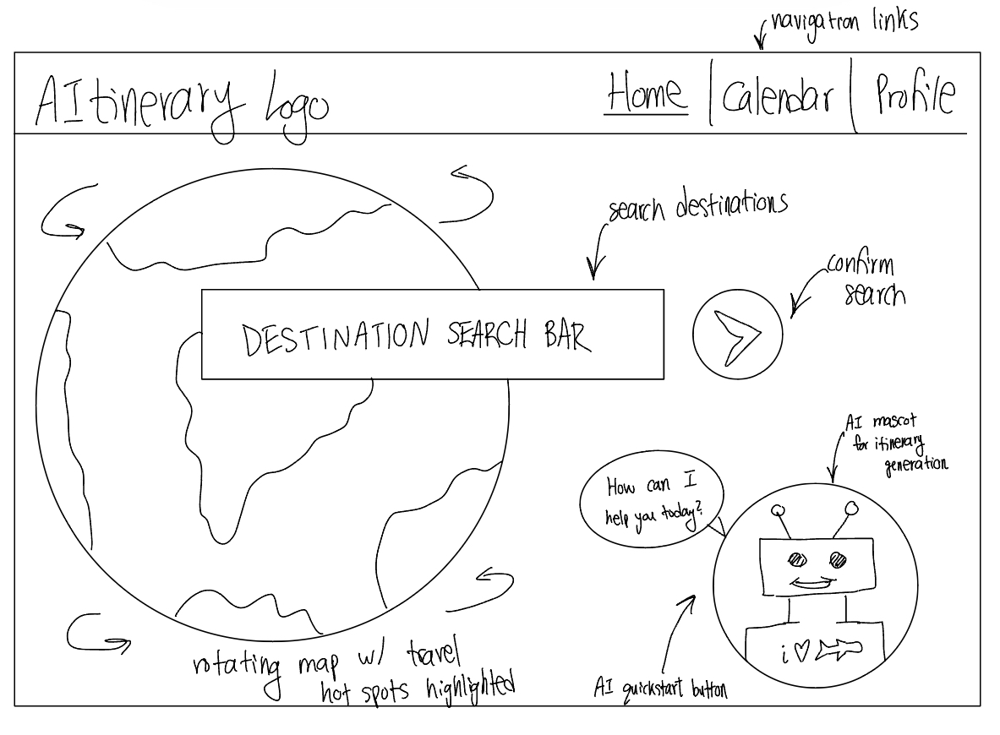
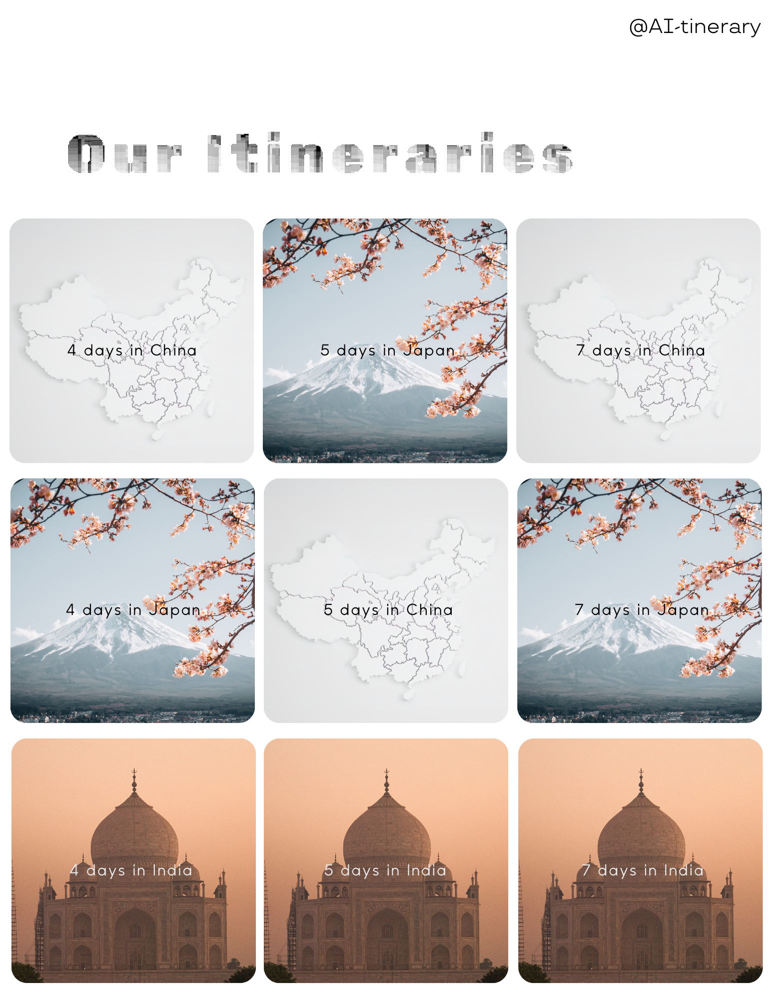
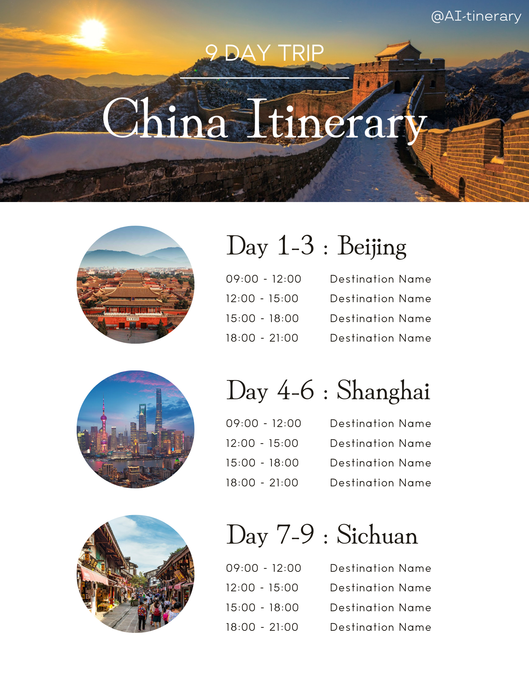
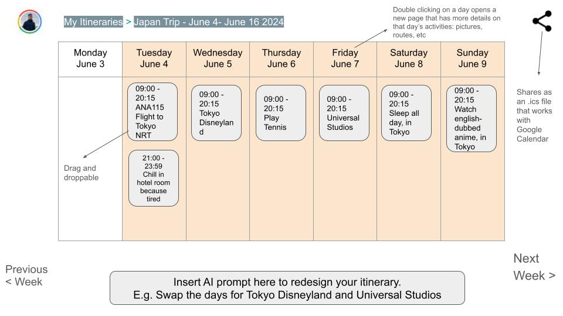
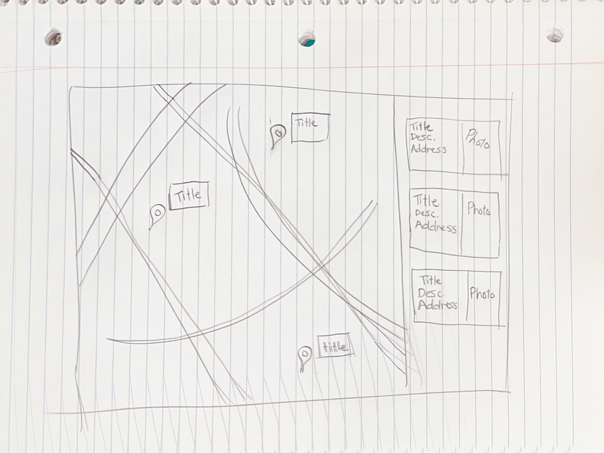

# Group 22 - AI-tinerary

### Deploy Status: 

## Project Description

Our project is for travelers. From the absolute beginnners to the travel connoisseurs, our app is for anyone with wanderlust! Of course, you can never be too young or old to travel, so our app is perfectly suited for students, adults, parents, and even whole families.

Our app will allow users to browse different travel destinations. By collecting user data through in-app activity as well as periodic surveys, our app will make travel itinerary and destination suggestions based on a user's preferences via the power of AI.

In order to support this, the app will store user data including region whitelists, blacklists, temperature and transportation method preferences, as well as personal user information including names and emails.

If time permits, some additional functionality that we can add is the ability to create travel interaries for how to arrive to a destination, instead of just excursions while already there. Moreover, we can allow users to group their itineraries with other users if they are traveling together. On the other hand, if we are tight on time, we can remove the AI functionality altogether, and just have manual itinerary creation and destination tracking within our app.

## Project Task Requirements:

### Minimal requirements

1. Account creation / authentication
   - Find a suitable API for authentication
   - Create login / sign-up page and associated styling elements
   - Ensure users stay signed-in on page refresh (JWT)
2. Collect data on users via surveys
   - Draft format of surveys
     - Hot versus cold destinations
     - Travel distance preferences
   - Create a popup window to prompt users to take the survey
     - Create associated UI components
   - Initialize a database to store associated user data
     - Populate user data from survey for future itinerary-creation
3. Allow users to browse different travel destinations
4. Allow for manual itinerary creation

### Standard requirements

1. Use AI to create itineraries
2. Include calendar functionality to track upcoming travel
   - Have the itinerary sync to Google Calendar / Outlook
3. View previously-visited destinations and itineraries in a gallery
4. Be able to favorite different locations when browsing
5. Be able to whitelist and blacklist various locations if desired
6. Interactive map view
   - Be able to drop pins and see pictures of destinations
   - Include danger warnings for different destinations
     - Political unrest markers
     - Weather concern markers
   - Be able to see recently popular travel destinations

### Stretch requirements

1. Create itineraries on how to get to the destination
   - Include information on flights and hotels
   - Incorporate a user's budget into this
2. Create a family and friends list
   - Allow for group-based itineraries and linking with other accounts
3. Collect user data based on search history and website traffic

## Team Members

- Nand Patel: Hello, I am a fourth year computer science and mathematics student and I love taking photos with my film camera :-D
- Jiayin Kralik: I am a fourth year computer science student who is interested in systems! I'm building my own operating system this summer :)
- Matthew Smith: I'm a BCS student, I have a background in Physics, and I'm passionate about SWE!
- Chris Tjondro: I like tennis. I like food. Lesson learned: Food after tennis -> Good, Food before tennis -> Bad.

## Images

- Matthew: Home page
  - 
- Jiayin: User-specific itineraries + browse itineraries
  - 
  - 
- Chris: Calendar View
  - 
- Nand: Map-view
  - 

## References
